# Main Figure Algorithm Flow Specification

This document is a figure specification for the current DynaMix2skill method. It is based on the live repository, current config files, and completed run artifacts available on 2026-07-02.

Primary repo:

```text
/mnt/data/yaodong/codes/DynaMix2skill
```

Primary completed evidence run used in this spec:

```text
/mnt/data/yaodong/codes/DynaMix2skill/runs/static_qwen35_awq_8bembed_chunk8000_minsplit4_after_budget_fix_20260702_111541/scenarios/static_build
```

Older stronger completed run for score reference:

```text
/mnt/data/yaodong/codes/DynaMix2skill/runs/static_qwen35_awq_xml8_20260618_144604
```

## 0. Required Audit

### 0.1 Current repo, worktree, entrypoints, configs, and artifacts

Current code directory:

```text
/mnt/data/yaodong/codes/DynaMix2skill
```

Current Git state:

- `main` is at `e933ca5 Revert to pre-OfficeQA static baseline`.
- The working tree has local uncommitted changes in configs, scripts, `src/dynamix_core`, `src/dynamix_trace2skill`, and tests.
- This spec reflects the live working tree, not only the committed `e933ca5` snapshot.

Main experiment entrypoint:

```text
scripts/run_dynamix_trace2skill_experiment.py
```

Tree build entrypoint:

```text
scripts/build_dynamix_tree.py
src/dynamix_trace2skill/pipeline.py::build_tree_from_records
src/dynamix_core/tree_builder.py::ProjectedGmmTreeBuilder
```

Current config file:

```text
configs/dynamix_static_qwen.json
```

Important caveat: the active run used command-line overrides. For example, the completed `chunk8000` run used `gmm_bic.min_split_size=4`, while `configs/dynamix_static_qwen.json` currently contains `min_split_size=2`.

Key completed artifacts:

```text
dynamix_tree/summary.json
dynamix_tree/hierarchy_state.json
dynamix_tree/hierarchy_layers.json
dynamix_tree/skills/node_bank_manifest.json
dynamix_tree/skills/.dynamix_skillbank_index.json
raw/skill_selection_records.jsonl
trace2skill_heldout_results.json
trace2skill_heldout_eval.json
experiment_stage_report.json
experiment_stage_report.md
```

Completed run facts from `static_qwen35_awq_8bembed_chunk8000_minsplit4_after_budget_fix_20260702_111541`:

- Train records: `200`.
- Raw trajectory success/failure in train records: `75` success, `125` failure.
- Hierarchy item count: `556`.
- Community count: `237`.
- Layer count: `7`.
- Exported nodebank nodes: `356`.
- Node levels: L1 `239`, L2 `62`, L3 `31`, L4 `14`, L5 `7`, L6 `3`.
- One L0 oversize singleton was excluded: task `191-40`, prompt-token estimate `99832 > 85000`.
- Heldout split: `200..400`.
- Heldout score with LibreOffice recalc: `81/200 = 40.5%`.
- Raw audit without LibreOffice recalc: `62/200 = 31.0%`.

Older completed run facts from `static_qwen35_awq_xml8_20260618_144604`:

- Train records: `200`.
- Exported nodebank nodes: `357`.
- Heldout score with LibreOffice recalc: `86/200 = 43.0%`.
- Use this as a historical completed result, not as the active run config unless the exact config is restored.

Runs that should not be drawn as current mainline:

- OfficeQA integration attempts: not active after reverting to pre-OfficeQA static baseline.
- Static ablation scaffolding: not active main method.
- Dynamic update scenario: implemented in code, but not the current completed mainline evidence.
- Legacy skill-folder export / full `SKILL.md` embedding: README still mentions it, but live exporter now emits nodebank only.

### 0.2 Current active algorithm mainline

The current active mainline is:

```text
Trace2Skill SpreadsheetBench rollout logs
-> RawTrajectoryRecord
-> L0 trajectory ExperienceItem
-> trajectory embedding with chunked mean pooling
-> projected weighted GMM-BIC soft clustering
-> cluster-level Trace2Skill-style ExperienceCard extraction
-> recursive ExperienceCard abstraction
-> node-level nodebank export
-> per-heldout-task top-k node retrieval
-> Retrieved Experience injected into the ReAct system prompt
-> SpreadsheetBench heldout execution
-> LibreOffice recalc official evaluation
```

It is not currently:

- A per-trajectory `TraceSkillCard` pipeline. There is no active `TraceSkillCard` class in live code.
- A skill-folder `SKILL.md` package pipeline. Live `SkillExportConfig` says `skill_md_files_generated: False`.
- A strict Trace2Skill iterative failure replay/patch verification loop. Metadata explicitly records `iterative_rca_loop: False`.
- A dynamic update experiment as the current main figure evidence line.
- OfficeQA as the current main benchmark.

### 0.3 Current input data

Current train input:

```text
/mnt/data/yaodong/codes/DynaMix2skill/runs/static_qwen35_awq_xml8_20260618_144604/records.json
```

The active run writes an ordered copy:

```text
/mnt/data/yaodong/codes/DynaMix2skill/runs/static_qwen35_awq_8bembed_chunk8000_minsplit4_after_budget_fix_20260702_111541/scenarios/static_build/ordered_records.json
```

Ordering policy:

```text
records are ordered by dataset.json train slice order; no filename sorting or random shuffling
```

Train split:

```text
0..200
```

Heldout split:

```text
200..400
```

There is no evidence in the active DynaMix2skill run that it uses a canonical `601` raw episodes protocol. The current active run uses exactly `200` train trajectory records and `200` heldout tasks from SpreadsheetBench verified 400.

Each `RawTrajectoryRecord` contains:

- `trajectory_id`
- `task_id`
- `trial_index`
- `instruction`
- `instruction_type`
- `answer_position`
- `spreadsheet_path`
- `output_path`
- `final_response`
- `success`
- `verifier_score`
- `verifier_feedback`
- `steps`
- `runtime_metadata`
- `service_metadata`
- `extra`

Each trajectory step contains:

- `step_id`
- `raw_model_output`
- `action`
- `observation`
- `tool_name`
- `action_valid`

Fields entering trajectory embedding:

```text
instruction
instruction_type
trajectory_steps.raw_model_output
trajectory_steps.action
trajectory_steps.observation
```

Fields deliberately excluded from trajectory embedding:

```text
answer_position
spreadsheet_path
output_path
verifier_score
verifier_feedback
ground-truth output
local paths
```

Fields entering cluster analyst prompts:

```text
instruction
instruction_type
answer_position
spreadsheet_path
output_path
success
verifier_score
verifier_feedback
final_response
trajectory_steps
runtime_metadata
service_metadata
extra
```

This means `answer_position` is not used for similarity/retrieval, but it is present in analyst evidence and in the actual heldout task prompt because SpreadsheetBench requires the agent to know the target region.

Data leakage assessment:

- Train build uses train records only.
- Heldout retrieval query excludes `answer_position`.
- Heldout task prompt includes `answer_position`, but that is part of the official task input, not retrieval.
- Nodebank export excludes raw L0 trajectories and diagnostic oversize nodes.
- The active run logs selected node ids for each heldout task.

### 0.4 Current intermediate objects

`RawTrajectoryRecord`:

- Defined in `src/dynamix_trace2skill/schemas.py`.
- Represents parsed Trace2Skill/ReAct trajectory logs plus task/evaluator metadata.

`ExperienceItem`:

- Defined in `src/dynamix_core/data_structures.py`.
- General item in the hierarchy.
- L0 items have `kind="trajectory"`.
- L1+ items have `kind="experience_card"`.

`ExperienceCommunity`:

- Defined in `src/dynamix_core/data_structures.py`.
- Stores a level, selected `member_weights`, full `posterior_member_weights`, generated item ids, support mass, success/failure counts, outcome mode, and clustering metadata.

`ExperienceLayer`:

- Stores layer-level input items, communities, generated items, stop reason, and metadata.

`ExperienceCard`:

- Not a separate dataclass. It is represented as an `ExperienceItem` with `kind="experience_card"` and metadata fields:
  - `name`
  - `trigger`
  - `content`
  - `confidence`
  - `placement`
  - `source_community_id`
  - `source_member_count`
  - `analyst_mode`

`Nodebank node`:

- Exported as an `ExportedSkillNode` in `src/dynamix_core/skill_export.py`.
- One retrievable node per exportable ExperienceCard item.
- Embedding text uses only:

```text
name: ...
trigger: ...
content: ...
```

`SKILL.md`:

- Not generated by the current live exporter.
- Current `node_bank_manifest.json` records `skill_md_files_generated: False`.

`Retrieved Experience`:

- Runtime system-prompt block generated by `selected_experience_to_system_content()` in `src/dynamix_trace2skill/skillbank.py`.
- Contains selected node names, triggers, and content.

`Heldout selection manifest`:

```text
raw/skill_selection_records.jsonl
```

It records:

- `instance_id`
- `instruction`
- `instruction_type`
- `answer_position`
- retrieval `query`
- `top_k`
- `selected_node_ids`
- `selected_node_scores`
- selected node metadata

## Part A. One-Sentence Method Definition

```text
Method name:
DynaMix nodebank hierarchy for Trace2Skill-style spreadsheet agents

One-sentence summary:
DynaMix converts training agent trajectories into a soft hierarchical bank of reusable ExperienceCards, then retrieves task-relevant experience nodes at heldout time and injects them into the spreadsheet ReAct agent prompt.

Core idea:
Cluster and recursively abstract execution evidence before test-time retrieval, so the agent receives reusable procedure-level guidance rather than raw episodic traces or a monolithic skill file.

What problem it solves:
It addresses the brittleness of flat trajectory memory and oversized skill files by inducing compact, query-retrievable experience nodes from many training trajectories.

What is different from Trace2Skill / RAPTOR / simple retrieval memory:
Unlike Trace2Skill, the current method does not merge trajectory-local patches into a static skill file; unlike RAPTOR, the leaves are agent trajectories and cluster summaries are executable-task experience cards; unlike plain retrieval, retrieval is over recursively induced ExperienceCard nodes rather than raw logs.
```

Caption-ready one-liner:

> DynaMix induces a soft hierarchy of reusable experience nodes from agent execution trajectories and uses task-conditioned top-k node retrieval to preload relevant guidance during heldout spreadsheet execution.

## Part B. Main Figure Core Story

### 1. What should readers understand in 5 seconds?

Raw agent trajectories are not directly retrieved at test time. They are converted into a hierarchical memory of compact ExperienceCards through embedding, soft GMM-BIC clustering, and LLM abstraction; a heldout task retrieves only the most relevant nodes and injects them into the ReAct prompt.

### 2. Input to intermediate abstraction to skill memory to test-time use

The main data flow is:

```text
Train spreadsheet tasks
-> Trace2Skill-style ReAct rollouts
-> RawTrajectoryRecord
-> L0 trajectory embeddings
-> overlapping GMM-BIC communities
-> L1 ExperienceCards
-> recursive L2+ ExperienceCard abstractions
-> nodebank manifest + embedding index
-> heldout query retrieves top-k nodes
-> Retrieved Experience block in system prompt
-> spreadsheet agent writes output.xlsx
-> LibreOffice official evaluator
```

### 3. Main contribution modules

The main figure should visually emphasize:

- Cluster-level trajectory-to-experience induction, not per-trace skill extraction.
- Soft overlapping GMM-BIC hierarchy, where one trajectory/card can support multiple communities.
- Recursive abstraction from L1 cards to higher-level cards.
- Node-level retrieval bank that avoids oversized `SKILL.md` files.
- Train/heldout separation with logged selected node ids.

### 4. Engineering support modules that should be smaller

These should be shown only as small labels or appendix details:

- tmux/background execution.
- server endpoints and ports.
- conda/Python environment.
- retry and timeout logic.
- cache implementation details.
- worker ids.
- exact run directory names.

### 5. Baseline comparisons that can be shown in a small inset

Useful main-figure inset:

- Trace2Skill: local trajectory analysis to skill patch/skill file.
- Plain retrieval memory: retrieve raw traces or flat cards.
- RAPTOR: chunk clustering and summary tree for document retrieval.
- DynaMix: trajectory evidence to soft ExperienceCard hierarchy to nodebank prompt injection.

### 6. Appendix-only figure material

Put these outside the main figure:

- Dynamic update scenario.
- OfficeQA adapter work.
- Static ablation variants.
- Budget-refinement routing-tree internals.
- LibreOffice recalc implementation.
- Exact `run_dynamix_trace2skill_experiment.py` stage markers.
- Token accounting and prompt preflight internals.

## Part C. Suggested Main Figure Layouts

### Layout 1: Horizontal Pipeline

Panels:

1. `Training Rollouts`
2. `Experience Induction`
3. `Soft Hierarchical Memory`
4. `Nodebank Retrieval`
5. `Heldout Execution + Verifier`

Boxes:

- SpreadsheetBench train tasks.
- Trace2Skill-style ReAct trajectory logs.
- RawTrajectoryRecord normalization.
- Embedding with chunked mean pooling.
- GMM-BIC soft clustering.
- Cluster analyst LLM.
- ExperienceCard nodes across L1..L6.
- Nodebank manifest and embedding index.
- Heldout query encoder.
- Top-k selected nodes.
- Prompt composer.
- Spreadsheet ReAct agent.
- LibreOffice official evaluator.

Arrows:

- Solid arrows for train/build data flow.
- Solid arrows for heldout inference data flow.
- Dashed arrow from nodebank to heldout retriever.
- Dashed line separating train/build from heldout/test.
- Optional dotted arrows for ablations or dynamic future work, but only in appendix.

Color suggestions:

- Blue: raw tasks and trajectories.
- Orange: embeddings/clustering.
- Green: LLM-generated ExperienceCards.
- Purple: nodebank/retrieval.
- Gray: evaluator and logging.

Pros:

- Easiest for reviewers to parse.
- Good for a paper main figure.

Cons:

- Soft hierarchy may look compressed unless zoomed.

### Layout 2: Two-Stage Offline / Online

Upper half: `Offline Skill Induction`

```text
Train trajectories -> trajectory embeddings -> soft communities -> LLM abstraction -> nodebank
```

Lower half: `Online Heldout Solving`

```text
Heldout task -> query embedding -> top-k node retrieval -> prompt injection -> agent execution -> evaluator
```

Boundary:

- A thick horizontal line separates build-time from test-time.
- Mark nodebank as frozen for heldout.
- Label: `No heldout memory update in active static experiment`.

Pros:

- Best for addressing data leakage concerns.
- Clearly shows retrieval is online but memory construction is offline.

Cons:

- Less visually focused on tree structure unless a zoom-in is added.

### Layout 3: Hierarchical Tree Zoom-In

Left:

```text
Trajectory evidence
```

Middle:

```text
Overlapping GMM-BIC hierarchy
```

Right:

```text
Retrieved Experience prompt injection
```

Tree zoom:

- Draw L0 trajectory dots.
- Draw overlapping soft memberships as semi-transparent edges from a dot to multiple L0 communities.
- Draw L1 cards produced by each L0 community.
- Draw L2+ cards as higher-level abstractions.
- Show a heldout query selecting nodes across different levels.

Pros:

- Best for showing the actual novelty: soft hierarchy of experience nodes.

Cons:

- Needs careful visual design to avoid looking like a generic tree.

### Recommended Layout

Use Layout 2 as the main layout, with a zoom-in from Layout 3 embedded in the upper half.

Reason:

- It makes train/test separation explicit.
- It gives a central visual place to the soft hierarchical induction mechanism.
- It avoids overemphasizing implementation details.
- It lets the right-hand online panel clearly show what enters the heldout system prompt.

## Part D. Detailed Algorithm Flow by Figure Module

### Step 1. Raw trajectory collection / existing raw input

Step name:
Raw SpreadsheetBench ReAct rollouts

Input:
SpreadsheetBench verified tasks from `data/spreadsheetbench_verified/spreadsheetbench_verified_400`, train slice `0..200`.

Operation:
Trace2Skill-style spreadsheet agent runs with bash/openpyxl actions and writes logs/results. The active static rebuild reuses an existing `records.json` rather than rerunning train trajectories.

Output:
`RawTrajectoryRecord` rows.

Artifact path / object name:

```text
runs/static_qwen35_awq_xml8_20260618_144604/records.json
runs/static_qwen35_awq_8bembed_chunk8000_minsplit4_after_budget_fix_20260702_111541/scenarios/static_build/ordered_records.json
src/dynamix_trace2skill/schemas.py::RawTrajectoryRecord
```

What to draw:
Spreadsheet task icon, ReAct transcript, verifier signal, raw trajectory store.

Important labels:

- `train 0..200`
- `200 trajectories`
- `75 success / 125 failure`
- `ReAct actions + observations`

Potential caption text:
Training spreadsheet tasks are converted into structured trajectory records containing instructions, actions, observations, and verifier outcomes.

### Step 2. Normalize and order records

Step name:
Canonical trajectory record ordering

Input:
Existing `records.json`.

Operation:
When `enforce_dataset_order=true`, records are reordered to match `dataset.json` train slice order. Log parsing can deduplicate by `trajectory_id`; the active rebuild starts from already materialized records.

Output:
Ordered records.

Artifact path / object name:

```text
src/dynamix_trace2skill/log_parser.py::load_records
src/dynamix_trace2skill/pipeline.py::_load_records_for_protocol
records_order_manifest.json
ordered_records.json
```

What to draw:
Raw episodes to canonical trajectory records.

Important labels:

- `dataset-order train slice`
- `no random shuffling`
- `no answer_position in embedding`

Potential caption text:
Records are aligned to the official dataset split before tree construction to prevent accidental task-order drift.

### Step 3. L0 trajectory item construction

Step name:
Trajectory to L0 ExperienceItem

Input:
`RawTrajectoryRecord`.

Operation:
Each record becomes an `ExperienceItem` with `kind="trajectory"`, `level=0`, full analysis bundle metadata, success label, verifier score, and token-count metadata.

Output:
L0 trajectory items.

Artifact path / object name:

```text
src/dynamix_trace2skill/pipeline.py::_records_to_items
src/dynamix_core/data_structures.py::ExperienceItem
```

What to draw:
Trajectory cards entering the hierarchy as L0 evidence.

Important labels:

- `L0 = raw trajectory evidence`
- `support_mass = 1`
- `analysis bundle retained for analyst`

Potential caption text:
Raw trajectories become level-0 evidence items, preserving execution context for cluster-level analysis.

### Step 4. Trajectory embedding

Step name:
Chunked trajectory embedding

Input:
Rendered embedding trace:

```text
instruction
instruction_type
trajectory_steps.raw_model_output/action/observation
```

Operation:
Long trajectories are split into sliding windows and embedded; chunk vectors are mean-pooled into one trajectory vector.

Output:
One embedding vector per trajectory item.

Artifact path / object name:

```text
src/dynamix_trace2skill/trace_views.py::render_embedding_trace
src/dynamix_trace2skill/long_embeddings.py::embed_records_chunked_mean
analysis/chunked_embedding_report.json
```

Current run values:

- embedding model: `Qwen3-Embedding-8B`
- max model length: `32000`
- chunk tokens: `8000`
- overlap tokens: `1000`
- pooling: `mean`
- total chunks: `426`
- over-model-limit texts: `18`
- max input token count: `90566`

What to draw:
Trace text to vector `z_i`.

Important labels:

- `z_i = phi(x_i)`
- `sliding chunks + mean pooling`
- `answer_position excluded`

Potential caption text:
Trajectory similarity is computed from task instructions and observed execution behavior, not answer ranges or gold labels.

### Step 5. Soft clustering / hierarchical induction

Step name:
Projected weighted GMM-BIC soft clustering

Input:
Embeddings at current level.

Operation:
Embeddings are row-normalized, projected by local PCA, then clustered by weighted GMM. BIC chooses K. Posterior responsibilities are converted into selected memberships using cumulative mass soft assignment.

Output:
Overlapping `ExperienceCommunity` objects.

Artifact path / object name:

```text
src/dynamix_core/projection.py
src/dynamix_core/gmm_bic.py
src/dynamix_core/tree_builder.py::ProjectedGmmTreeBuilder.cluster_layer
src/dynamix_core/data_structures.py::ExperienceCommunity
hierarchy_layers.json
```

Current run values:

- projection: local PCA, variance ratio `0.90`, max dim `32`.
- GMM covariance: `spherical`.
- BIC searched K up to `64` at L0.
- L0 BIC selected K=`3`, followed by budget refinement.
- soft assignment: `cumulative_mass`, coverage `0.90`, max membership gap `0.25`.
- budget refinement applies to L0 only.

What to draw:
Embedding dots connected to one or more soft communities with responsibility-weighted edges.

Important labels:

- `r_ik = p(c_k | z_i)`
- `BIC selects K`
- `overlap allowed`
- `support mass`

Potential caption text:
Soft clustering lets a trajectory or experience card support multiple reusable patterns when posterior mass indicates overlap.

### Step 6. Budget refinement for overlong raw communities

Step name:
Prompt-budget-safe L0 refinement

Input:
L0 communities and analyst prompt token budget.

Operation:
If an L0 community exceeds the analyst prompt budget, it is recursively refined with local GMM-BIC splits and feasible leaves are flattened back into L0. Singleton trajectories that still exceed the same prompt budget are excluded as diagnostics.

Output:
Budget-fit L0 communities plus excluded oversize singleton diagnostics.

Artifact path / object name:

```text
src/dynamix_core/tree_builder.py::_refine_overbudget_coarse_communities
analysis/cluster_prompt_token_report.json
hierarchy_layers.json
```

Current run evidence:

- analyst prompt budget: `85000`.
- one oversize singleton excluded: `191-40`, token cost `99832`.

What to draw:
Small inset inside offline build: "over-budget raw community -> local split -> feasible communities; oversize singleton excluded".

Important labels:

- `L0 only`
- `same analyst prompt budget`
- `diagnostic exclusion, not nodebank memory`

Potential caption text:
Budget refinement prevents oversized raw trajectory clusters from entering the analyst prompt without inventing a separate singleton budget.

### Step 7. LLM synthesis / recursive abstraction

Step name:
Trace2Skill-style cluster analyst

Input:
Each `ExperienceCommunity` plus its member evidence.

Operation:
`ClusterAnalyst` calls the generation model with adapted Trace2Skill success/error templates and a minimal JSON schema. L0 raw trajectory communities may produce multiple cards. L1+ communities must compress lower-level cards into exactly one higher-level card.

Output:
ExperienceCard items at the next level.

Artifact path / object name:

```text
src/dynamix_trace2skill/summary.py::ClusterAnalyst
src/dynamix_trace2skill/summary.py::ClusterAnalyst.summarize
src/dynamix_trace2skill/summary.py::_infer_analyst_mode
```

Current card schema:

```text
name
trigger
content
placement
confidence
```

Important implementation detail:

- `iterative_rca_loop: False`; the active version does not run Trace2Skill's iterative minimal-fix verifier loop.
- Success/failure handling is prompt-conditioned by community outcome and inherited templates, not separate success/failure modules with replay verification.

What to draw:
Community evidence to LLM abstraction to ExperienceCard node.

Important labels:

- `L0: one or more cards`
- `L1+: one abstraction card`
- `Trace2Skill-style evidence discipline`
- `not replay verified`

Potential caption text:
The analyst transforms clusters of trajectory evidence or lower-level cards into compact reusable experience nodes.

### Step 8. Recursive hierarchy construction

Step name:
Recursive ExperienceCard hierarchy

Input:
Generated ExperienceCards from the previous layer.

Operation:
Generated cards become the next layer's items. The same embedding/clustering/LLM abstraction loop repeats until BIC selects one, the layer is too small, or `max_levels` is reached.

Output:
Multi-level ExperienceCard hierarchy.

Artifact path / object name:

```text
src/dynamix_core/tree_builder.py::ProjectedGmmTreeBuilder.build
hierarchy_state.json
hierarchy_layers.json
```

Current completed layer summary:

```text
L0 input 200 -> 239 L1 cards, chosen_k=3 plus budget refinement, excluded=1
L1 input 239 -> 62 L2 cards, chosen_k=62
L2 input 62 -> 31 L3 cards, chosen_k=31
L3 input 31 -> 14 L4 cards, chosen_k=14
L4 input 14 -> 7 L5 cards, chosen_k=7
L5 input 7 -> 3 L6 cards, chosen_k=3
L6 input 3 -> stop too_small
```

What to draw:
Layered node pyramid/tree with L0 evidence at bottom and L1..L6 cards above.

Important labels:

- `recursive abstraction`
- `stop: too_small / BIC K=1`
- `not a single root in current run`

Potential caption text:
The hierarchy stops before forcing an artificial root if the remaining items are too small or BIC does not support another split.

### Step 9. Nodebank export

Step name:
ExperienceCard nodebank export

Input:
Final hierarchy state.

Operation:
Export every non-diagnostic `ExperienceItem(kind="experience_card")` as one nodebank entry. L0 raw trajectories are excluded. Diagnostic oversize/skipped nodes are excluded. The exporter writes a manifest and builds a dense embedding index.

Output:
Nodebank directory and embedding index.

Artifact path / object name:

```text
src/dynamix_core/skill_export.py::export_skill_files
src/dynamix_core/skill_export.py::export_skill_files_from_payload
dynamix_tree/skills/node_bank_manifest.json
dynamix_tree/skills/.dynamix_skillbank_index.json
```

Current export policy:

```text
retrieval_unit: experience_card_node
embedding_fields: name, trigger, content
trajectory_items_exported: false
diagnostic_oversize_nodes_exported: false
skill_md_files_generated: false
heldout_retrieval: dense_top_k_nodes
```

What to draw:
Hierarchy to nodebank manifest/index, not to a folder of `SKILL.md` files.

Important labels:

- `356 retrievable nodes`
- `name + trigger + content`
- `no L0 raw traces`
- `no SKILL.md generated`

Potential caption text:
The memory exported to heldout inference is a node-level bank of ExperienceCards, not a monolithic skill document.

### Step 10. Online retrieval / prompt injection

Step name:
Task-conditioned Retrieved Experience

Input:
Heldout task instruction and instruction type.

Operation:
The heldout agent builds a retrieval query:

```text
{instruction}

Task type: {instruction_type}
```

The query embedding is compared against cached node embeddings. Top-k node snippets are rendered as `# Retrieved Experience` and injected into the skill slot of the spreadsheet agent system prompt.

Output:
Task-specific system prompt with retrieved node guidance.

Artifact path / object name:

```text
spreadsheet_agent/agents/cli_skill_preloaded_agent.py::_build_skillbank_query
spreadsheet_agent/agents/cli_skill_preloaded_agent.py::_select_skills_for_context
src/dynamix_trace2skill/skillbank.py::SkillBankSelector
src/dynamix_trace2skill/skillbank.py::selected_experience_to_system_content
raw/skill_selection_records.jsonl
```

Current run values:

- top-k: `10`
- query excludes `answer_position`
- selected node ids are logged for all 200 heldout tasks
- heldout memory is not updated in the static run

What to draw:
Heldout query to query embedding to top-k nodes to prompt composer.

Important labels:

- `query = instruction + task type`
- `answer_position excluded from retrieval`
- `top-k = 10 in current runs`
- `selected node ids logged`

Potential caption text:
At test time, DynaMix retrieves task-relevant experience nodes and injects their guidance into the agent's system prompt without updating the memory.

### Step 11. Heldout execution and official evaluation

Step name:
Spreadsheet heldout execution and LibreOffice recalc evaluation

Input:
Heldout SpreadsheetBench tasks `200..400`, retrieved experience system prompt, task prompt.

Operation:
The `cli_skill_preloaded` spreadsheet agent runs ReAct bash actions in the current task directory and writes `output.xlsx`. Evaluation uses SpreadsheetBench official logic with LibreOffice recalculation before comparing answer ranges.

Output:
Heldout results and evaluation summary.

Artifact path / object name:

```text
run_spreadsheetbench.py
evaluate_with_official.py
trace2skill_heldout_results.json
trace2skill_heldout_eval.json
```

Current completed score:

- `81/200 = 40.5%` in the latest completed `chunk8000/min_split_size=4` run.
- Historical `static_qwen35_awq_xml8_20260618_144604`: `86/200 = 43.0%`.

What to draw:
Prompted spreadsheet agent to output workbook to official verifier.

Important labels:

- `heldout 200..400`
- `no memory update`
- `LibreOffice recalc`
- `official SpreadsheetBench evaluator`

Potential caption text:
The retrieved nodebank is used only as prompt context; final success is measured by the official workbook evaluator after recalculating formulas.

## Part E. Key Mathematical / Algorithm Symbols

Embedding:

```math
z_i = \phi(x_i)
```

where `x_i` is the rendered trajectory embedding trace.

Chunked mean embedding:

```math
z_i = \frac{1}{|W_i|}\sum_{w \in W_i} \phi(w)
```

where `W_i` are overlapping token windows of a long trajectory.

GMM responsibility:

```math
r_{ik} = p(c_k \mid z_i)
```

Soft selected memberships:

```math
S_i = \operatorname{CumulativeMass}(r_i; \tau=0.9, \Delta=0.25)
```

Cluster-to-card synthesis:

```math
e_k^{\ell+1} = \operatorname{LLM}(C_k^\ell)
```

Recursive abstraction:

```math
\mathcal{X}^{\ell+1} = \{ \operatorname{LLM}(C_k^\ell) \}_k
```

Nodebank retrieval:

```math
\operatorname{TopK}(q) =
\arg\max_{u \in \mathcal{M}} \cos(\phi(q), \phi(u))
```

Prompt injection in the current implementation:

```math
\operatorname{Prompt}(q) =
[\operatorname{System}_{\mathrm{ReAct}}(\operatorname{TopK}_{\mathcal{M}}(q));\ \operatorname{TaskPrompt}(q)]
```

Do not use this formula for the current implementation:

```math
\operatorname{Prompt}(q) = [q; \mathrm{SKILL.md}; \mathrm{TopK}(q)]
```

because live code does not generate or inject a full `SKILL.md`.

## Part F. Innovation Callouts

### Implemented contribution

1. Trajectory-cluster experience induction
   - Location in figure: Offline build panel after raw trajectories.
   - Callout: "LLM extracts reusable guidance from clusters of execution evidence, not from isolated traces."

2. Soft overlapping GMM-BIC hierarchy
   - Location in figure: central hierarchy zoom.
   - Callout: "Posterior responsibilities allow one trajectory/card to support multiple reusable patterns."

3. Recursive ExperienceCard abstraction
   - Location in figure: hierarchy levels L1..L6.
   - Callout: "Lower-level operational lessons are recursively compressed into higher-level reusable guidance."

4. Node-level retrieval bank
   - Location in figure: memory export block.
   - Callout: "Each ExperienceCard node is independently embedded and retrievable via name, trigger, and content."

5. Test-time task-conditioned prompt injection
   - Location in figure: online panel.
   - Callout: "Heldout tasks retrieve top-k relevant nodes; selected ids are logged and memory remains frozen."

### Partially implemented / should be drawn carefully

1. Success/failure analysis
   - The analyst prompt inherits Trace2Skill success/error templates and sees success/failure metadata.
   - It is not a separate verified RCA replay loop.

2. Skill export
   - Export exists as nodebank.
   - Traditional `SKILL.md` folder export is not active.

3. Dynamic update
   - Code exists.
   - It is not the active completed mainline result.

### Future direction / do not draw as current method

1. Iterative Trace2Skill-style failure reroll verification.
2. OfficeQA benchmark support.
3. Dynamic online tree maintenance as the paper's main result.
4. Static ablation variants as core method.
5. Full skill-folder `SKILL.md + support files` packaging.

## Part G. Comparison Inset

| Method | Input unit | Intermediate knowledge | Clustering / hierarchy | Failure handling | Online use | Main limitation |
|---|---|---|---|---|---|---|
| Trace2Skill | Single trajectory and task logs | Local patches / skill updates | No DynaMix soft hierarchy | Success/error analysis and patch-style refinement in upstream method | Preloaded skill files | Can produce large or conservative skill files; weaker global organization |
| RAPTOR-style tree summarization | Text chunks | Summary nodes | Embedding clustering and recursive summaries | Not agent-failure specific | Retrieve document summaries/chunks | Not designed around agent actions, verifier outcomes, or executable spreadsheet operations |
| Plain retrieval memory | Raw traces or flat cards | Episodic examples or flat lessons | Usually none or flat nearest-neighbor index | Often no structured failure abstraction | Retrieve top-k examples/cards | No cluster-level abstraction; can be noisy and redundant |
| Current DynaMix2skill | ReAct trajectory records | Minimal ExperienceCards and higher-level abstractions | Projected weighted GMM-BIC with soft memberships and recursive LLM abstraction | Prompt-conditioned success/failure evidence; no replay verification in active version | Retrieve top-k nodebank ExperienceCards and inject Retrieved Experience | Current export is nodebank-only; strict failure verification/dynamic update are not active mainline |

## Part H. Figure Drawing Checklist

| Box name | Short label | Long label | Input | Output | Icon suggestion | Color suggestion | Main figure? | Reason |
|---|---|---|---|---|---|---|---|---|
| Spreadsheet task | Train tasks | SpreadsheetBench train slice | dataset rows | task prompts | spreadsheet grid | blue | yes | Shows source of trajectories |
| ReAct trajectory | Agent rollout | Trace2Skill-style bash/openpyxl ReAct execution | task prompt | messages/actions/observations | terminal + sheet | blue | yes | Raw evidence unit |
| Verifier | Train verifier signal | Official train evaluator result | output workbook | success/score/feedback | checkmark | gray | yes, small | Used in analyst evidence |
| Raw trajectory store | RawTrajectoryRecord | Structured trajectory records | logs/results | records.json | database | blue | yes | Reproducible input object |
| Normalize/order | Canonical records | Dataset-order alignment | records.json | ordered_records.json | sorting arrows | blue-gray | yes, small | Prevents split/order drift |
| L0 item builder | L0 evidence | Trajectory ExperienceItems | records | L0 items | document cards | blue | yes | Connects data to hierarchy |
| Embedding cache | Trajectory vectors | Chunked Qwen3-Embedding-8B vectors | rendered traces | z_i | vector dots | orange | yes | Enables clustering |
| Soft clustering | GMM-BIC communities | Projected weighted GMM-BIC soft assignments | embeddings | communities | overlapping circles | orange | yes | Core novelty |
| Budget refinement | Token-safe refinement | L0 overbudget community splitting | raw communities | feasible leaves | scissors | orange-gray | appendix or small | Important but not central story |
| LLM abstraction | Cluster analyst | Trace2Skill-style cluster ExperienceCard synthesis | communities | cards | LLM node | green | yes | Core knowledge induction |
| Experience node | ExperienceCard | name/trigger/content card | LLM output | nodebank unit | note card | green | yes | Memory object |
| Hierarchy state | Recursive tree | L1..L6 ExperienceCard hierarchy | cards | state/layers | tree | green | yes | Main method structure |
| Skill exporter | Nodebank exporter | ExperienceCard node manifest | hierarchy | node_bank_manifest | package/index | purple | yes | Current export mechanism |
| SKILL.md | Legacy skill file | Traditional skill folder file | hierarchy | SKILL.md | file | no | Current code does not generate it |
| Support files | References/scripts | Auxiliary skill files | skill folder | support files | folder | no | Not active in nodebank exporter |
| Query encoder | Heldout query | instruction + Task type | heldout task | query vector | magnifier | purple | yes | Shows test-time retrieval |
| Top-k retriever | Node retrieval | Dense top-k node selection | query + node index | selected nodes | ranked list | purple | yes | Core online mechanism |
| Prompt composer | Retrieved Experience | Fill system prompt skill slot | selected nodes | system prompt | prompt page | purple | yes | Shows what model sees |
| Heldout agent | Spreadsheet agent | cli_skill_preloaded ReAct agent | prompt/task | output.xlsx | robot + terminal | blue-purple | yes | Online execution |
| Official evaluator | LibreOffice verifier | Recalc then compare workbook | output.xlsx | score | calculator/check | gray | yes, small | Evaluation endpoint |

## Part I. Do Not Put In Main Figure

Do not draw:

- IP addresses or ports.
- API keys.
- tmux sessions.
- conda paths.
- worker ids.
- retry waits/timeouts.
- run directory names.
- debug logs and generation debug files.
- exact cache sqlite file internals.
- OfficeQA code.
- static ablation variants.
- failed experiments.
- legacy `SKILL.md` folder export as if current.
- strict failure replay verification as if implemented.
- dynamic update as current result.

Appendix system figure candidates:

- Stage markers and resume fingerprints.
- Prompt token reports.
- Budget refinement routing tree.
- LibreOffice recalc evaluator.
- Embedding chunking statistics.
- Selection log audit trail.

## Part J. Current Implementation vs Ideal Paper Figure Gaps

| Gap | Why it matters for figure | Fix before drawing main figure? | Suggested fix |
|---|---|---|---|
| README still says skill folders / `SKILL.md` embedding | It conflicts with live nodebank code and can mislead the figure | yes | Base the main figure on `skill_export.py` and `node_bank_manifest.json`; optionally update README later |
| Prompt request mentions full `SKILL.md + top-5`, but live code uses nodebank top-k snippets | Main online panel could be wrong | yes | Draw `Retrieved Experience` node snippets; label top-k as configurable and current runs as k=10 |
| `TraceSkillCard` is not an active class | Figure may invent a non-existent object | yes | Use `ExperienceCard` as the actual object |
| Strict failure replay verification is not active | Overclaiming this would be a major protocol issue | yes | Mark RCA/replay as future or not implemented |
| Dynamic update code exists but is not current main result | Could confuse static heldout evidence with dynamic method | yes | Keep dynamic update in appendix/future panel only |
| Current run excluded one oversize singleton | Main figure should not imply every train trajectory becomes memory | yes | Add small `budget guard / exclude oversize singleton` note |
| Higher-level BIC often selects large K values | Reviewers may ask whether hierarchy is too branching | no for figure, yes for analysis | Use ablation/appendix to justify GMM-BIC and soft hierarchy |
| Latest completed run is 40.5%, older run is 43.0% | Paper score claim depends on which config is official | yes before paper claim | Lock exact official config/run before writing result claims |
| `answer_position` enters analyst prompt but not embedding/retrieval | Needs careful leakage explanation | yes | Figure label: retrieval excludes answer position; task prompt includes official answer range |
| Support files are not seen by model in nodebank mode | Figure should not show support files | yes | Do not draw support files in main figure |
| Selected node ids are logged | Good audit feature | no | Draw small log icon or mention in caption |

## Part K. Final Deliverables

### Version 1: Main paper figure caption

DynaMix2skill converts spreadsheet-agent execution trajectories into a query-retrievable hierarchy of reusable experience. During offline construction, Trace2Skill-style ReAct rollouts are normalized into trajectory records, embedded with chunked mean pooling, softly clustered by projected GMM-BIC, and summarized by an LLM into minimal ExperienceCards. The same clustering-and-abstraction loop recursively induces higher-level cards, which are exported as a nodebank whose retrievable text contains only each node's name, trigger, and content. During heldout execution, the memory is frozen: each task forms a query from its instruction and task type, retrieves the top-k relevant nodes, injects them as Retrieved Experience into the spreadsheet ReAct system prompt, and writes an output workbook. Evaluation is performed by the official SpreadsheetBench logic with LibreOffice recalculation. The figure separates offline induction from online retrieval to emphasize train/heldout isolation and avoid confusing nodebank retrieval with legacy `SKILL.md` export.

### Version 2: Panel-by-panel description

Panel 1: Training evidence.
Show SpreadsheetBench train tasks feeding a Trace2Skill-style spreadsheet ReAct agent. The output is a structured `RawTrajectoryRecord` store containing instructions, actions, observations, and verifier outcomes. Label the current evidence slice as train `0..200`, with 200 trajectories.

Panel 2: Trajectory embedding and soft communities.
Show each raw trajectory rendered into an embedding trace that excludes `answer_position`. Long traces are split into overlapping chunks and mean-pooled into one vector. The vectors go through local PCA and weighted GMM-BIC; posterior edges show that one trajectory can belong to multiple communities.

Panel 3: Recursive ExperienceCard abstraction.
Show each community passed to a Trace2Skill-style cluster analyst. L0 raw trajectory communities can emit multiple ExperienceCards, while higher-level card communities emit one abstraction card. Repeat this loop upward until the hierarchy stops; draw the current run as L1..L6 without forcing a single root.

Panel 4: Nodebank memory export.
Show non-diagnostic ExperienceCards exported as nodebank entries. Each node has `name`, `trigger`, and `content`; raw trajectories and oversize diagnostics are excluded. The export writes `node_bank_manifest.json` and a cached embedding index, not `SKILL.md` files.

Panel 5: Heldout retrieval and execution.
Show a heldout query built from `instruction + Task type`, explicitly excluding `answer_position` for retrieval. The query retrieves top-k ExperienceCard nodes and injects them into the `Retrieved Experience` section of the system prompt. The spreadsheet ReAct agent executes on `input.xlsx`, writes `output.xlsx`, and the official evaluator performs LibreOffice recalculation before scoring.

### Version 3: Mermaid draft

```mermaid
flowchart LR
  subgraph Offline["Offline build-time induction (train only)"]
    A["SpreadsheetBench train tasks\n0..200"] --> B["Trace2Skill-style ReAct rollouts\nbash/openpyxl actions"]
    B --> C["RawTrajectoryRecord store\ninstruction, steps, verifier signal"]
    C --> D["Canonical ordering\nmatch dataset.json train slice"]
    D --> E["Embedding trace\ninstruction + instruction_type + actions/observations\nanswer_position excluded"]
    E --> F["Chunked embedding\nQwen3-Embedding-8B\nsliding windows + mean pooling"]
    F --> G["Projected weighted GMM-BIC\nlocal PCA + BIC K selection"]
    G --> H["Soft communities\ncumulative mass memberships\nsupport mass"]
    H --> I["Trace2Skill-style cluster analyst\nL0 raw clusters -> one or more ExperienceCards\nL1+ clusters -> one abstraction card"]
    I --> J["Recursive ExperienceCard hierarchy\nL1 ... L6\nno forced root"]
    J --> K["Nodebank export\nnode_bank_manifest.json\nname + trigger + content"]
    K --> L["Dense node index\n.dynamix_skillbank_index.json"]
  end

  subgraph Online["Online heldout solving (memory frozen)"]
    M["Heldout task\ninstruction + spreadsheet context"] --> N["Retrieval query\ninstruction + Task type\nanswer_position excluded"]
    N --> O["Top-k node retrieval\ncurrent runs: k=10"]
    L --> O
    O --> P["Prompt composer\n# Retrieved Experience\nselected node guidance"]
    P --> Q["cli_skill_preloaded ReAct agent\nwrites output.xlsx"]
    Q --> R["Official SpreadsheetBench eval\nLibreOffice recalc + workbook compare"]
  end

  K -. "train-only memory" .-> O
```



## Recommended Main Figure Claim Boundary

The main figure may claim:

- DynaMix builds a train-only soft hierarchical ExperienceCard memory from agent trajectories.
- DynaMix exports node-level retrievable experience units.
- Heldout tasks retrieve top-k nodes and use them as prompt context.
- Current evaluation uses official SpreadsheetBench with LibreOffice recalculation.

The main figure should not claim:

- The current method performs Trace2Skill iterative failure reroll verification.
- The current exporter creates full `SKILL.md` skill folders.
- Heldout tasks update the memory.
- OfficeQA is part of the active mainline.
- Dynamic update is the basis of the current static heldout score.
